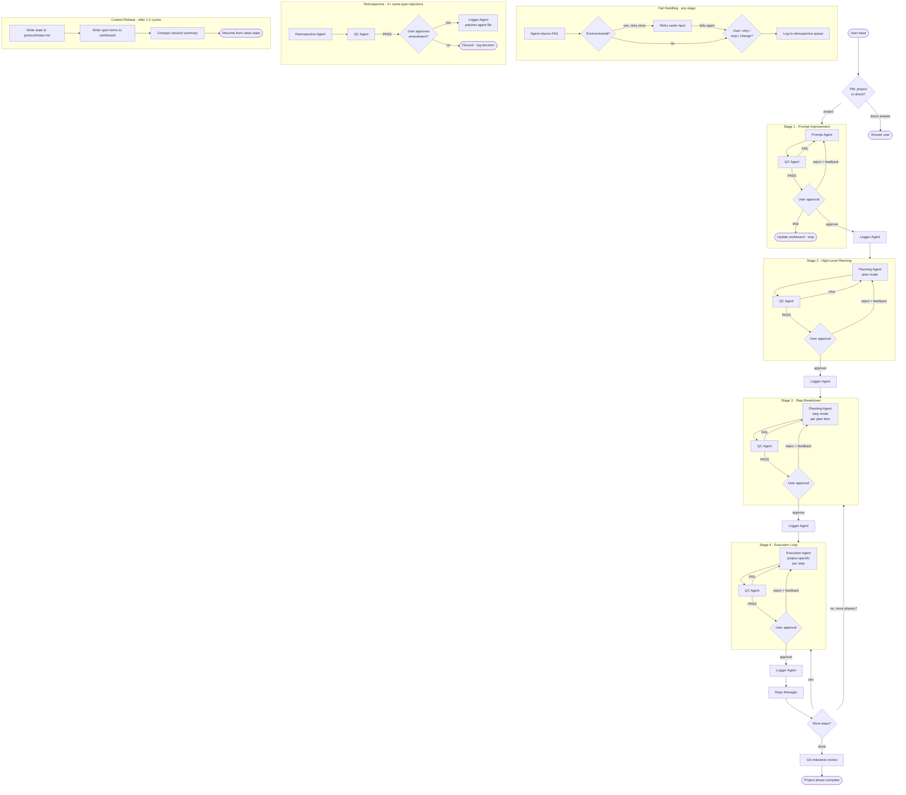

# Pipeline Flow

## Notes

- **QC loops** are tight — FAIL sends back to the same agent with the QC verdict, not to the user
- **User approval** is the only gate that can stop, redirect, or approve
- **Logger Agent** fires post-approval, never blocking
- **Repo Manager** fires post-cycle, never blocking
- **Retrospective** runs in parallel to the main pipeline — it amends agent profiles, not current pipeline state
- **GA** is invoked at phase completion, not within stages
- **Parallel execution** is permitted in Stage 3 and Stage 4 for independent items — each runs as a separate job ID in `work/`
